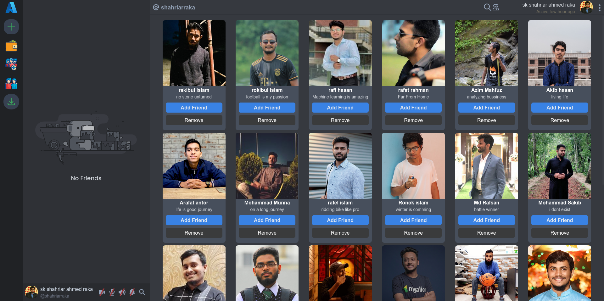

Messenger Complete

Send/Receieve friend  request , chat with friends and send/receive money

Complete project , still many things to upgrade

- Front-end : Svelte, Sveltekit, Tailwindcss, Typescript

- Backend : Golang, Gorilla Mux , Gin framework

- Container: Docker , Docker Compose

- Object Storage : MinIO

- Database : MongoDB , PostgresQL

- Protocol :  HTTP , Websocket

